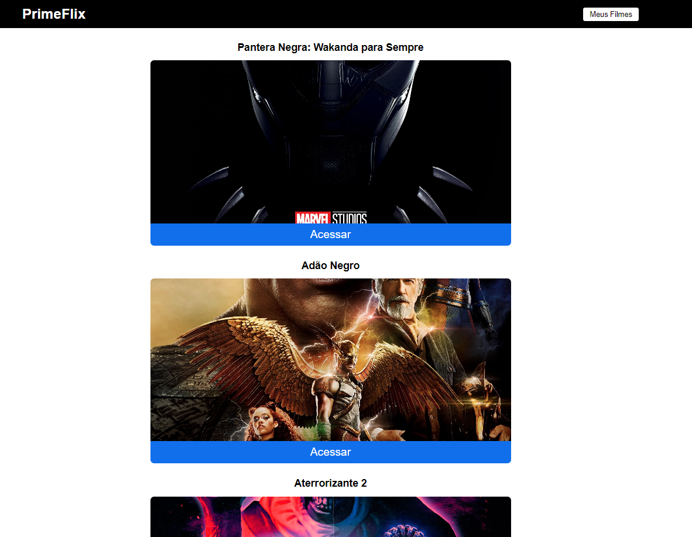

<h1 align="center"> PRIMEFLIX </h1>

  <a href="#-tecnologias">Tecnologias</a>&nbsp;&nbsp;&nbsp;|&nbsp;&nbsp;&nbsp;
  <a href="#-projeto">Projeto</a>&nbsp;&nbsp;&nbsp;|&nbsp;&nbsp;&nbsp;

 

  

## 🚀 Tecnologias

Esse projeto foi desenvolvido com as seguintes tecnologias:

- HTML e CSS
- JavaScript
- [Node e NPM](https://nodejs.org/)
- [Vercel](primeflix-ejyhxh8rg-danielkhalils.vercel.app)

## 💻 Projeto

O projeto tem como objetivo apresentar uma lista de filmes em cartaz e já lançados, bem como suas avaliações. É possível salvar os filmes em uma lista pessoal, bem como excluí-los de seus favoritos.  

[CLIQUE AQUI](primeflix-ejyhxh8rg-danielkhalils.vercel.app) PARA VISUALIZAR O PROJETO!

